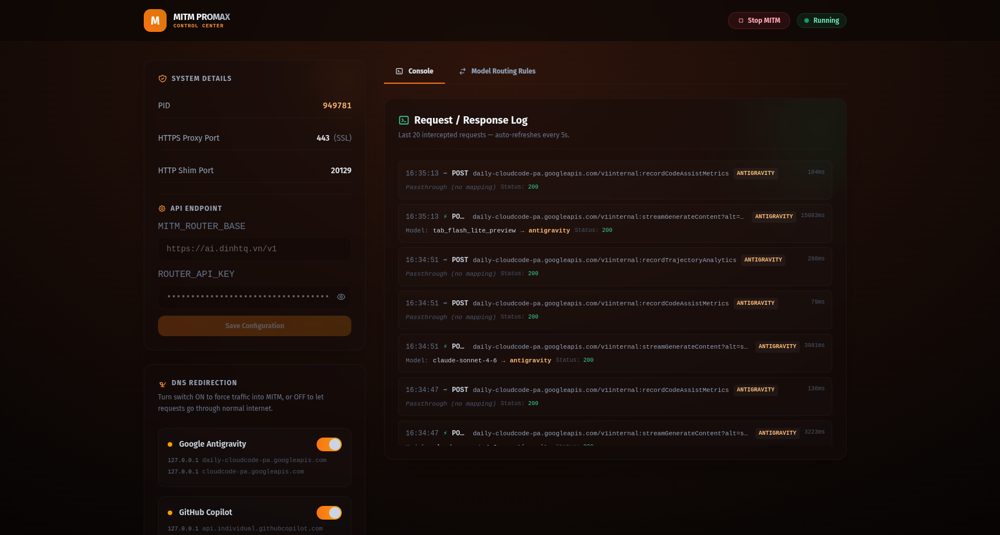
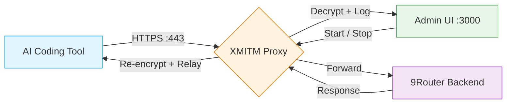

<div align="center">
  
  <h1>🔀 XMITM</h1>
  <p>
    <strong>Express MITM Proxy — Intercept, log, and route AI coding tool traffic</strong>
  </p>
  <p>
    
    
    
  </p>
</div>

---

## 📋 Overview

**XMITM** (Express MITM) is a lightweight Man-in-the-Middle proxy that intercepts, logs, and routes AI coding assistant traffic through a custom backend. It supports:

- 🟢 **Antigravity** (Google Gemini)
- 🔵 **GitHub Copilot**
- 🟣 **Kiro** (AWS)
- 🟠 **Cursor**

It dynamically issues SSL certificates for intercepted domains and provides a web-based admin dashboard to control the proxy lifecycle.

### ✨ Features

| Feature | Description |
|---------|-------------|
| 🛡️ **HTTPS Interception** | Dynamically generates SSL certificates via SNI callbacks |
| 🤖 **Multi-Tool Support** | Antigravity, Copilot, Cursor, Kiro |
| 🌐 **Admin Dashboard** | Web UI at `http://127.0.0.1:3000` |
| 📝 **Request Logging** | Real-time viewer with expandable request/response details |
| 🔄 **Model Alias Routing** | Route models via SQLite alias database |
| 🧹 **Auto Cleanup** | Removes DNS entries on shutdown |
| 🔌 **Zero Config** | Plug-and-play with automatic CA certificate setup |

---

## 🚀 Quick Start

### Prerequisites

- [Node.js](https://nodejs.org/) >= 16
- **Linux/macOS**: `sudo` access (port 443, DNS management)
- **Windows**: Administrator privileges

### Installation

```bash
git clone <your-repo-url>
cd xmitm
npm install
cp .env.example .env   # Then edit .env with your backend URL & API key
```

### Running

#### Linux / macOS

```bash
chmod +x start-admin.sh
./start-admin.sh
```

#### Windows

Right-click `start-admin.bat` → **Run as administrator**

> [!TIP]
> The admin UI runs on **port 3000** — no elevated permissions needed. Only starting the MITM proxy (port 443) requires sudo/admin.

Open **http://127.0.0.1:3000** in your browser.

---

## 🖥️ Admin Dashboard


| Button / Section | Description |
|------------------|-------------|
| **Start MITM** | Starts the proxy (requires sudo password on Linux/macOS) |
| **Stop MITM** | Stops the proxy and cleans up DNS entries |
| **Console Logs** | Real-time request/response viewer with copy buttons |
| **DNS Status** | Live check of all intercepted domains |
| **Credentials** | View captured auth tokens / machine IDs |

---

## 🔧 Configuration

### Environment Variables

| Variable | Default | Description |
|----------|---------|-------------|
| `MITM_ROUTER_BASE` | `http://localhost:20128` | 9Router backend URL |
| `ROUTER_API_KEY` | — | API key for 9Router auth |

### Intercepted Domains

| Tool | Domain(s) |
|------|-----------|
| 🟢 **Antigravity (Gemini)** | `daily-cloudcode-pa.googleapis.com`, `cloudcode-pa.googleapis.com` |
| 🔵 **GitHub Copilot** | `api.individual.githubcopilot.com` |
| 🟣 **Kiro** | `q.us-east-1.amazonaws.com`, `codewhisperer.us-east-1.amazonaws.com` |
| 🟠 **Cursor** | `api2.cursor.sh` |

---

## 📁 Project Structure

```
xmitm/
├── index.js                  # Entry point → loads admin-server
├── start-admin.sh            # Linux/macOS startup script
├── start-admin.bat           # Windows startup script
├── package.json
├── mitm.png                  # Admin dashboard screenshot
├── .gitignore
├── .env.example              # Environment template
├── aliases.json              # Model alias definitions
├── aliases.example.json      # Alias template
│
├── src/
│   ├── admin-server.js       # Admin UI server (port 3000) + REST API
│   ├── admin.html            # Admin dashboard frontend
│   ├── server.js             # Core MITM proxy (port 443)
│   ├── config.js             # URL patterns & model config
│   ├── credentials.js        # Read credentials from local IDE storage
│   ├── dbReader.js           # SQLite alias database reader
│   ├── logStore.js           # Request log storage (in-memory)
│   ├── logger.js             # Logging utility
│   ├── paths.js              # Path resolution
│   ├── winElevated.js        # Windows elevated helper (PowerShell UAC)
│   │
│   ├── cert/                 # SSL certificate management
│   │   ├── generate.js       # Leaf certificate generation
│   │   ├── install.js        # CA installation (Linux/macOS/Windows)
│   │   └── rootCA.js         # Root CA key/cert management
│   │
│   ├── dns/
│   │   └── dnsConfig.js      # Hosts file management (add/remove DNS)
│   │
│   └── handlers/             # Tool-specific request/response handlers
│       ├── base.js           # Shared fetch + SSE logic
│       ├── antigravity.js    # Antigravity / Gemini handler
│       ├── copilot.js        # GitHub Copilot handler
│       ├── cursor.js         # Cursor handler (not yet implemented)
│       └── kiro.js           # Kiro / AWS handler
│
├── shared/
│   └── constants/
│       └── mitmToolHosts.js  # Per-tool DNS host definitions
│
└── data/                     # Runtime data (gitignored)
```

---

## 🧠 Architecture



1. **Admin UI** (`admin-server.js` on port `3000`) — serves the dashboard and REST API
2. **MITM Proxy** (`server.js` on port `443`) — intercepts HTTPS traffic with dynamically generated SSL certificates
3. **DNS Manager** (`dns/dnsConfig.js`) — manages `/etc/hosts` entries to redirect traffic
4. **Log Store** (`logStore.js`) — captures request/response data in memory for the dashboard

---

## 🔐 Sudo / Admin Password

When you click **Start** on the admin dashboard, XMITM needs elevated privileges:

- **Linux / macOS**: You'll be prompted for your `sudo` password (to bind port 443 and modify `/etc/hosts`)
- **Windows**: UAC prompt via the `runElevatedPowerShell` helper

If the password is incorrect, the dashboard shows an error and lets you retry.

---

## 🤝 Contributing

Contributions are welcome! Feel free to open issues or submit pull requests.

1. Fork the repository
2. Create a feature branch (`git checkout -b feature/amazing-feature`)
3. Commit your changes (`git commit -m 'Add amazing feature'`)
4. Push to the branch (`git push origin feature/amazing-feature`)
5. Open a Pull Request

---

## 📄 License

MIT License — see [LICENSE](LICENSE) for details.

---

<div align="center">
  <sub>Built with ❤️ as part of the 9Router ecosystem</sub>
</div>
